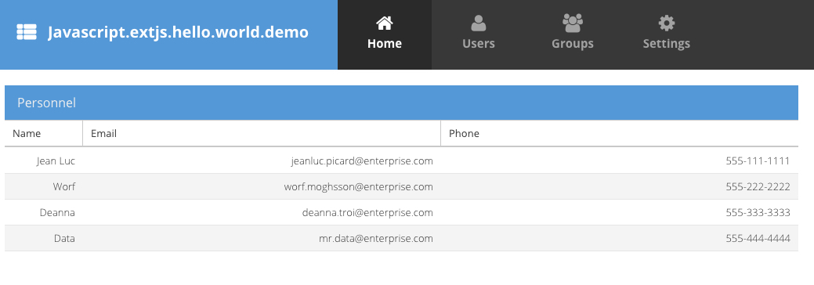

JavaScript ExtJS Hello World Demo
=================================

使用ExtJS跟使用别的开源框架不一样，相当麻烦。它的教程上说“没有比我们更简单的了”，搞了我两个小时还没搞出来。

ExtJS有商业版和GPL版本。其中GPL目前最新版是`6.2.0`，而商业版是`6.5.x`。
我们要使用GPL版本，还需要注意相关的工具`@extjs/sencha-cmd`也使用旧版，否则出错，害我重新来一遍。

教程也要看旧版的：<https://docs.sencha.com/extjs/6.2.1/guides/getting_started/getting_started.html>

1. 你需要在网站上填写邮箱，取得下载链接：<https://www.sencha.com/legal/gpl/>。
   想直接`npm`下载或者找一个在线的cdn什么，都很难。
2. 收到邮件后，下载一个近200M的名为ext-6.2.0-gpl.zip的文件，解压到本地，比如`~/dev/ext-6.2.0`
3. 安装一个命令行工具：`npm install -g @extjs/sencha-cmd@6.2.1`。
   这里需要注意，官方提供的gpl版本不是最新的，所以sencha-cmd这里也要安装一个旧版，不然会出一些奇怪的错。
   `6.2.1`是最接近的版本。

然后使用`sencha-cmd`命令创建项目：

```
cd javascript-extjs-hello-world-demo
sencha -sdk /Users/freewind/dev/ext-6.2.0 generate app javascript-extjs-hello-world-demo ./
```

它会在当前目录下生成一大堆文件，基本上就是这个demo里出现的这些。

然后：

```
sencha app watch
```

再打开它显示的地址：<http://localhost:1841/>，出现了示例程序:



另外，直接`open index.html`也能看到同样的效果。

它把Ext所有的文件都拷贝到了`ext`目录下（我只想显示一个hello world）。

Resources
---------

- ExtJS十年浮沉录: <https://mp.weixin.qq.com/s?__biz=MzUxMzcxMzE5Ng==&mid=2247485484&amp;idx=1&amp;sn=9b5c1d62a78cb8fe819e5cbf685416f4&source=41>
